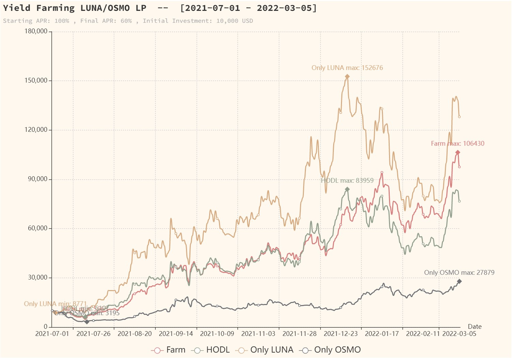
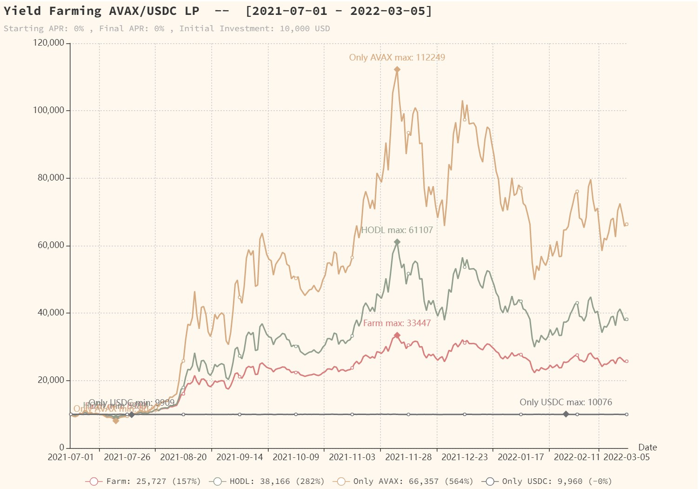

# Create Yield Farming Charts

### Farming LUNA/OSMO LP

```bash
# Simulates yield farming LUNA/OSMO LP on Osmosis DEX.
# - Starting APR  : 100%
# - Final APR     : 60%
# - Starting from : Jul 1, 2021
# - Duration      : 365 (number of days we want to harvest and compound yields)
#
$ go run examples/yield_farming/main.go --path /tmp --asset-a terra-luna --asset-b osmosis --apr 100.0 --final-apr 60 --start-date 2021-07-01

[2021-07-01] position  :  10,000.00  (IL:   0.00 , hodl:  10,000.00 , APR: 100.00 % , a:       6.54 , b:       4.01 , units: 764.00 / 1,247.38)
[2021-07-02] position  :   8,753.03  (IL:  -0.21 , hodl:   8,735.00 , APR:  99.84 % , a:       5.93 , b:       3.37 , units: 738.56 / 1,297.42)

... lots of rows removed ...

[2022-03-04] position  : 106,430.21  (IL: -28.04 , hodl:  83,124.51 , APR:  60.16 % , a:      90.56 , b:      11.18 , units: 587.65 / 4,761.86)
[2022-03-05] position  :  97,558.70  (IL: -27.28 , hodl:  76,651.23 , APR:  60.00 % , a:      83.82 , b:      10.11 , units: 581.95 / 4,824.31)

writing chart /tmp/yield-farming-luna-osmo-2021-07-01-2022-03-05.html
```

#### Renders HTML chart:



### Farming AVAX/USDC LP

```bash
# Simulates yield farming AVAX/USDC.e LP, but with 0% APR to see the full impact of impermanent loss.
# - Starting APR  : 0%
# - Final APR     : 0%
# - Starting from : Jul 1, 2021
# - Duration      : 365 (number of days we want to harvest and compound yields)
#
$ go run examples/yield_farming/main.go --path /tmp --asset-a avalanche-2 --asset-b usd-coin --apr 0.0 --final-apr 0.0 --start-date 2021-07-01

[2021-07-01] position  :  10,000.00  (IL:   0.00 , hodl:  10,000.00 , APR:   0.00 % , a:      11.98 , b:       1.00 , units: 417.38 / 4,983.67)
[2021-07-02] position  :   9,713.69  (IL:   0.05 , hodl:   9,718.26 , APR:   0.00 % , a:      11.28 , b:       1.00 , units: 430.39 / 4,833.02)

... lots of rows removed ...

[2022-03-04] position  :  25,599.92  (IL:  32.42 , hodl:  37,878.16 , APR:   0.00 % , a:      78.82 , b:       1.00 , units: 162.39 / 12,808.83)
[2022-03-05] position  :  25,726.79  (IL:  32.59 , hodl:  38,165.82 , APR:   0.00 % , a:      79.49 , b:       1.00 , units: 161.82 / 12,854.43)

writing chart /tmp/yield-farming-avax-usdc-2021-07-01-2022-03-05.html
```

#### Renders HTML chart:



# EMA 9/21-Day Trading Simulation

```golang
// examples/ema_9_21_trading_strategy/main.go
//
// Executes a basic trading strategy based on the Exponential Moving Average indicator (EMA).
// - When 9-day EMA crosses over the 21-day EMA indicator from below: Buy.
// - When 9-day EMA crosses over the 21-day EMA indicator from above: Sell.
//
import (
	"log"

	"github.com/anrid/traderbot/pkg/coingecko"
	"github.com/anrid/traderbot/pkg/jsoncache"
	"github.com/anrid/traderbot/pkg/trade"
)

func main() {
	cg := coingecko.New(coingecko.USD)

	id := "terra-luna"          // CoinGecko ID.
	var periodInDays uint = 365 // Start our trading strategy 365 ago counting from today.

	m, err := cg.MarketChartWithCache(id, periodInDays, jsoncache.InvalidateDaily)
	if err != nil {
		log.Fatal(err)
	}

	ema9d := trade.NewEMAIndicator(9, m.Prices)
	ema21d := trade.NewEMAIndicator(21, m.Prices)

	s, err := trade.NewEMACrossOverStrategy(ema9d, ema21d, m)
	if err != nil {
		log.Fatal(err)
	}

	initialInvestment := 10_000.0 // USD.

	trade.ExecuteTradesAndPrint("9-Day/21-Day EMS CrossOver Strategy", initialInvestment, s.Trades)
}
```

#### Output:

```bash
$ go run cmd/ema_trading_strategy_example/main.go 


Trading 'Terra' (LUNA) : 9-Day/21-Day EMS CrossOver Strategy
=============================================================

  1. [2021-04-27] buy  terra-luna @        17.6307  --  amount:    10,000.0000 , units:       567.1920
  2. [2021-05-13] sell terra-luna @        14.8174  --  amount:     8,404.2978 , units:       567.1920  [portfolio:     8,404.2978]
  3. [2021-07-07] buy  terra-luna @         6.4806  --  amount:     8,404.2978 , units:     1,296.8387
  4. [2021-07-21] sell terra-luna @         5.9036  --  amount:     7,656.0801 , units:     1,296.8387  [portfolio:     7,656.0801]
  5. [2021-07-23] buy  terra-luna @         7.3690  --  amount:     7,656.0801 , units:     1,038.9540
  6. [2021-09-22] sell terra-luna @        24.9468  --  amount:    25,918.5351 , units:     1,038.9540  [portfolio:    25,918.5351]
  7. [2021-09-24] buy  terra-luna @        36.4343  --  amount:    25,918.5351 , units:       711.3775
  8. [2021-10-17] sell terra-luna @        36.7548  --  amount:    26,146.5548 , units:       711.3775  [portfolio:    26,146.5548]
  9. [2021-10-21] buy  terra-luna @        42.8015  --  amount:    26,146.5548 , units:       610.8788
 10. [2021-11-19] sell terra-luna @        40.2905  --  amount:    24,612.6431 , units:       610.8788  [portfolio:    24,612.6431]
 11. [2021-11-30] buy  terra-luna @        51.5801  --  amount:    24,612.6431 , units:       477.1735
 12. [2022-01-09] sell terra-luna @        66.9792  --  amount:    31,960.7004 , units:       477.1735  [portfolio:    31,960.7004]
 13. [2022-01-16] buy  terra-luna @        87.6574  --  amount:    31,960.7004 , units:       364.6091
 14. [2022-01-22] sell terra-luna @        64.3927  --  amount:    23,478.1657 , units:       364.6091  [portfolio:    23,478.1657]
 15. [2022-02-25] buy  terra-luna @        65.4442  --  amount:    23,478.1657 , units:       358.7510


- Number of txns     : 15
- First buy          : 2021-04-27
- Last sell          : 2022-01-22  (270 days after first buy)
- Initial investment : 10,000.00
- Portfolio value    : 26,999.00
- P/L                : 169.99 %

```

# Yield Farming Simulations

```golang
// examples/yield_farming_simple/main.go
//
// Simulates yield farming LUNA/OSMO LP on Osmosis DEX.
// - Average APR: 75%.
// - Starting from Jul 1, 2021.
// - Daily harvesting and compounding for max 365 days.
//
import (
	"log"
	"time"

	"github.com/anrid/traderbot/pkg/coingecko"
	"github.com/anrid/traderbot/pkg/jsoncache"
	"github.com/anrid/traderbot/pkg/timeseries"
	"github.com/anrid/traderbot/pkg/trade"
)

func main() {
	cg := coingecko.New(coingecko.USD)

	var periodInDays uint = 365

	a, err := cg.MarketChartWithCache("terra-luna", periodInDays, jsoncache.InvalidateDaily)
	if err != nil {
		log.Fatal(err)
	}

	b, err := cg.MarketChartWithCache("osmosis", periodInDays, jsoncache.InvalidateDaily)
	if err != nil {
		log.Fatal(err)
	}

	startDate := "2021-07-01"
	harvestDays := 365
	initialInvestment := 10_000.0

	farm, err := trade.NewLPFarm(a, b, coingecko.USD, initialInvestment, startDate, 99.0 /* APR */)
	if err != nil {
		log.Fatal(err)
	}

	farm.SetAPRDailyDecay(0.15) // Lower APR by 0.15 percentage points every day.

	from := timeseries.ToTime(startDate)
	for i := 1; i <= harvestDays; /* number of days to harvest and compound yields */ i++ {
		cur := from.Add(time.Duration(i) * 24 * time.Hour)
		if cur.After(time.Now()) {
			break
		}
		farm.Harvest(timeseries.ToDate(cur))
	}
}
```

#### Output:

```bash
$ go run cmd/yield_farming_example/main.go

Using cached data : terra-luna-365-days-usd
Using cached data : osmosis-365-days-usd

[2021-07-02] position  :   8,752.79  (IL:  -0.20 , hodl:   8,735.00 , APR:  98.85 % , a:       5.93 , b:       3.37)
[2021-07-03] position  :   8,669.43  (IL:  -0.53 , hodl:   8,623.95 , APR:  98.70 % , a:       5.74 , b:       3.40)
[2021-07-04] position  :   8,816.55  (IL:  -0.80 , hodl:   8,746.45 , APR:  98.55 % , a:       5.81 , b:       3.45)
[2021-07-05] position  :   9,057.06  (IL:  -1.07 , hodl:   8,961.16 , APR:  98.40 % , a:       5.97 , b:       3.53)
[2021-07-06] position  :   9,429.79  (IL:  -1.35 , hodl:   9,303.98 , APR:  98.25 % , a:       6.15 , b:       3.69)
[2021-07-07] position  :   8,979.46  (IL:  -0.97 , hodl:   8,892.94 , APR:  98.10 % , a:       6.48 , b:       3.16)
[2021-07-08] position  :   9,067.94  (IL:   0.13 , hodl:   9,080.18 , APR:  97.95 % , a:       7.12 , b:       2.92)
[2021-07-09] position  :   8,081.00  (IL:   1.19 , hodl:   8,178.40 , APR:  97.80 % , a:       6.71 , b:       2.44)
[2021-07-10] position  :   8,616.12  (IL:   5.06 , hodl:   9,074.94 , APR:  97.65 % , a:       8.17 , b:       2.27)
[2021-07-11] position  :   8,720.93  (IL:   3.50 , hodl:   9,037.32 , APR:  97.50 % , a:       7.94 , b:       2.38)
[2021-07-12] position  :   8,864.39  (IL:   4.83 , hodl:   9,314.60 , APR:  97.35 % , a:       8.43 , b:       2.31)
[2021-07-13] position  :   7,934.92  (IL:   6.66 , hodl:   8,501.37 , APR:  97.20 % , a:       7.94 , b:       1.95)
[2021-07-14] position  :   7,047.61  (IL:   6.75 , hodl:   7,558.03 , APR:  97.05 % , a:       7.10 , b:       1.71)

... lots of rows removed ...

[2022-02-17] position  :  73,034.06  (IL: -35.32 , hodl:  53,972.72 , APR:  64.35 % , a:      56.14 , b:       8.88)
[2022-02-18] position  :  68,792.84  (IL: -39.30 , hodl:  49,383.69 , APR:  64.20 % , a:      50.34 , b:       8.76)
[2022-02-19] position  :  69,414.27  (IL: -39.36 , hodl:  49,807.65 , APR:  64.05 % , a:      50.82 , b:       8.80)
[2022-02-20] position  :  69,114.27  (IL: -39.63 , hodl:  49,499.36 , APR:  63.90 % , a:      50.50 , b:       8.75)
[2022-02-21] position  :  67,784.17  (IL: -39.61 , hodl:  48,551.16 , APR:  63.75 % , a:      49.61 , b:       8.54)
[2022-02-22] position  :  66,245.14  (IL: -36.87 , hodl:  48,400.05 , APR:  63.60 % , a:      50.25 , b:       8.02)
[2022-02-23] position  :  70,505.21  (IL: -35.19 , hodl:  52,151.53 , APR:  63.45 % , a:      54.67 , b:       8.33)
[2022-02-24] position  :  75,027.24  (IL: -33.04 , hodl:  56,395.63 , APR:  63.30 % , a:      59.79 , b:       8.59)
[2022-02-25] position  :  78,980.92  (IL: -29.88 , hodl:  60,809.89 , APR:  63.15 % , a:      65.44 , b:       8.67)
[2022-02-26] position  :  85,883.20  (IL: -27.61 , hodl:  67,302.13 , APR:  63.00 % , a:      73.18 , b:       9.13)
[2022-02-27] position  :  92,120.85  (IL: -28.55 , hodl:  71,658.79 , APR:  62.85 % , a:      77.69 , b:       9.86)
[2022-02-28] position  :  85,387.56  (IL: -27.89 , hodl:  66,765.55 , APR:  62.70 % , a:      72.64 , b:       9.03)
[2022-03-01] position  : 100,863.67  (IL: -22.72 , hodl:  82,193.25 , APR:  62.55 % , a:      91.26 , b:      10.00)
[2022-03-02] position  : 100,412.99  (IL: -23.59 , hodl:  81,247.15 , APR:  62.40 % , a:      90.00 , b:      10.01)
[2022-03-03] position  : 105,066.12  (IL: -25.68 , hodl:  83,600.55 , APR:  62.25 % , a:      91.97 , b:      10.69)

```

